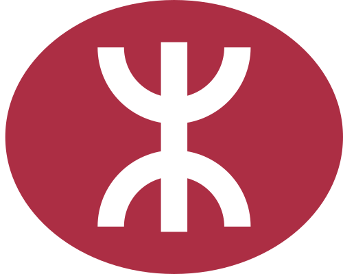

# 合併 GTFS 資料
下表記錄了合併 GTFS 資料 `npm run merge-route` 時發現的問題

## 已知問題
### 車站相關
GTFS 沒有該車站，無法配對。

大部份為特殊走線的車站。

| 公司 | 路線 | 問題 |
|---|:---:|---|
|  城巴 | 10, 76, 101, 111, 112, 116, 601, 680 | 跑馬地賽馬日改路 |
|  城巴 | 102 | 改經維園道 |
|  九巴 | 107P | 舊薄扶林狗房 |
|  城巴 | 15 | 花園道 |
|  城巴 | 1M | 以金鐘(東)為終站 |
|  城巴 | 2 | 國際金融中心商場, 興發街 |
|  城巴 | 25 | 軒尼詩道官立小學 |
|  城巴 | 307 | 維園正門 |
|  城巴 | 33X | 薄扶林道墳場 |
|  九巴 | 40B | 麗瑤及祖堯 [^1] |
|  九巴 | 586, 587, 589 | 錦駿苑 [^1] |
|  九巴 | 6C, 6F, 11B, 61X, 85A, 115 | 九龍城碼頭巴士總站(落客站) [^1] |
|  城巴 | 606 | 康民街 |
|  城巴 | 7, 91, 307 | 香港站 |
|  城巴 | 8H, 8X, 682, 694 | 青年廣場 |
|  九巴 | 88K | 顯徑巴士總站 (TA930)(落客站) [^1] |
|  城巴 | 905 | 修頓球場 |
|  城巴 | A20 | 浪澄灣 [^1] |
|  城巴 | B3 | 翠寧花園 [^1] |
|  城巴 | E11A, E11B, E21A, E21D, E21X, E22S, E23A, N21A, S52A, S56 | 修改於東湧之行車路線 [^1] |
|  城巴 | E22, E22A | 富東廣場 [^1] |
|  城巴 | E32A, E36A, N31 | 裕雅苑雅盛閣, 匯東街 [^1] |
|  港鐵巴士 | N216, N290 | 基順學校 > 利明樓 [^1] |
|  港鐵巴士 | K17 | 怡雅苑 [^1] |
|  城巴 | X15 | 中環 (香港摩天輪) |

### 路線相關
GTFS 沒有該路線，為特殊走線或只於特定時間提供服務。

資料取自巴士公司官網、[特別節日專營巴士路線列表](https://hkbus.fandom.com/wiki/%E7%89%B9%E5%88%A5%E7%AF%80%E6%97%A5%E5%B0%88%E7%87%9F%E5%B7%B4%E5%A3%AB%E8%B7%AF%E7%B7%9A%E5%88%97%E8%A1%A8)及[大型活動專營巴士路線列表](https://hkbus.fandom.com/wiki/%E5%A4%A7%E5%9E%8B%E6%B4%BB%E5%8B%95%E5%B0%88%E7%87%9F%E5%B7%B4%E5%A3%AB%E8%B7%AF%E7%B7%9A%E5%88%97%E8%A1%A8)

| 公司 | 路線 | 問題 |
|---|:---:|---|
|  九巴  城巴 | 101R, 102R | 跑馬地賽馬日散場 |
|  城巴 | 104R | 長洲太平清醮 |
|  九巴  城巴 | 118R | 小西灣運動場散場 |
|  城巴 | 173R | 中秋節 |
|  城巴 | 20R, 22R, H20 | 啟德郵輪碼頭有郵輪泊岸期間 |
|  九巴 | 23, 34 | 上課日 |
|  九巴 | 25R | 啟德郵輪碼頭有郵輪泊岸期間 |
|  九巴 | 28B | 經牛頭角總站缺少車站宏緻苑，路線配對錯誤 [^1]  |
|  九巴 | 268C | 觀塘定富街 - 朗屏站 |
|  九巴 | 278K | 缺少聯和墟總站，路線配對錯誤 [^2] |
|  九巴 | 30 | 葵涌(麗瑤邨) - 荃灣(荃威花園) |
|  九巴 | 3S, 14S, 38S, 52S, 61S, 70S, 73S, 74S, 76S, 279S | 清明節、重陽節 |
|  九巴 | 32P | 農曆新年、清明節、重陽節、盂蘭節 |
|  嶼巴 | 34S, 7S | 清明節、重陽節 |
|  九巴 | 36R, 41R, 87R, 98R, 215R, 224R, 259R, 260R, 269R, 270R, 271R | 紅磡香港體育館散場 |
|  嶼巴 | 37 | 奧運站 - 葵盛(中) routeType 2。未知路線，車站和 routeType 1 完全一樣 |
|  城巴 | 38S | 農曆新年 |
|  城巴 | 347, 388, 389, 971R | 清明節、重陽節 |
|  城巴 | 50R, 796R | 香港體育館散場 |
|  城巴 | 629 | 海洋公園 (正門／水上樂園) - 中環 (天星碼頭) |
|  城巴 | 629M | 海洋公園 (水上樂園) - 黃竹坑站 |
|  九巴 | 6R, 46R | 昂船洲海軍基地開放日 |
|  九巴 | 63R | 林村大型活動 |
|  九巴 | 64K | 錦上路站 - 上村 |
|  九巴 | 68R | 大棠大型活動 |
|  九巴 | 70K | 上水(清河) - 粉嶺(華明) |
|  九巴 | 71P | 農曆新年 |
|  城巴 | 73S | 端午節 |
|  九巴 | 77 | 新路線：2026年8月17日 [^1] |
|  城巴 | 770 | 新路線：2026年7月26日 [^1] |
|  九巴 | 78A | 皇后山 - 粉嶺名都 |
|  九巴 | 848, 868, 869, 872, 872X, 887, 888, 889, 891, 893 | 沙田馬場賽馬日進/散場 |
|  九巴 | 917 | 居民巴士NR917線 陽光巴士營辦 |
|  九巴 | 918 | 居民巴士NR918線 陽光巴士營辦 |
|  九巴 | 91B | 坑口站 - 香港科技大學 |
|  九巴 | 945 | 居民巴士NR945線 陽光巴士營辦 |
|  九巴 | 968 | 菲林明道 - 元朗(西) |
|  城巴 | 976S | 元旦日 |
|  九巴  城巴 | A25S, SP* | 啟德體育園散場 |
|  九巴 | A36 | 錦上路站 - 機場(地面運輸中心)(經機場博覽館) |
|  九巴 | B9 | 不經元朗路線 |
|  港鐵巴士 | K51 | 兆康站 - 富泰 |
|  港鐵巴士 | K52 | 輕鐵屯門站 - 龍鼓灘 |
|  港鐵巴士 | K66 | 大棠黃泥墩村 - 朗屏邨悅屏樓: GTFS 含有額外車站，無法配對。 南坑排 - 朗屏: GTFS 沒有該路線 |
|  港鐵巴士 | K68 | 元朗廣場 - 元朗工業邨、大橋村 - 元朗工業邨 |
|  港鐵巴士 | K75P | 洪水橋巴士廠 - 天瑞 |
|  港鐵巴士 | K75S | 洪水橋巴士廠 - 天水圍站 |
|  九巴  城巴 | N116, N601 | 農曆新年 |
|  九巴 | N276 | 指定週末及假日 |
|  九巴 | N43, N243, N272 | 聖誕節、元旦日、農曆新年 |
|  九巴 | N48 | 農曆新年 |
|  九巴 | N600, N603 | 元旦日、農曆新年 |
|  九巴 | N64P | 聖誕節、元旦日、農曆新年、中秋節 |
|  九巴 | N71 | 聖誕節、元旦日、農曆新年 |
|  嶼巴 | NB2 | 深圳灣口岸提供24小時通關 |
|  城巴 | NB3 | 深圳灣口岸提供24小時通關 |
|  九巴 | PB* | 寵物巴士團 |
|  九巴 | R108, R603, R934, R936, R948 | 港島指定長跑比賽日 |
|  城巴 | R11, R22 | 迪士尼樂園大型活動 |
|  九巴 | R215, R230, R241, R298 | 渣打馬拉松比賽日 |
|  九巴 | X1, X33, X36, X40, X43, X47 | 亞洲國際博覽館大型活動 |
|  城巴 | X1 | 亞洲國際博覽館大型活動 |
|  城巴 | X797 | 消防及救護學院開放日 |
|  九巴 | X90 | 消防及救護學院開放日 |

[^1] 等待 GTFS 更新
[^2] 等待巴士公司更新
